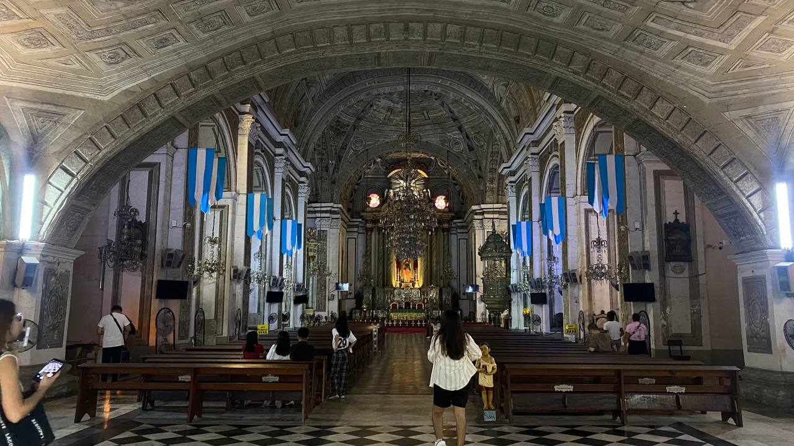
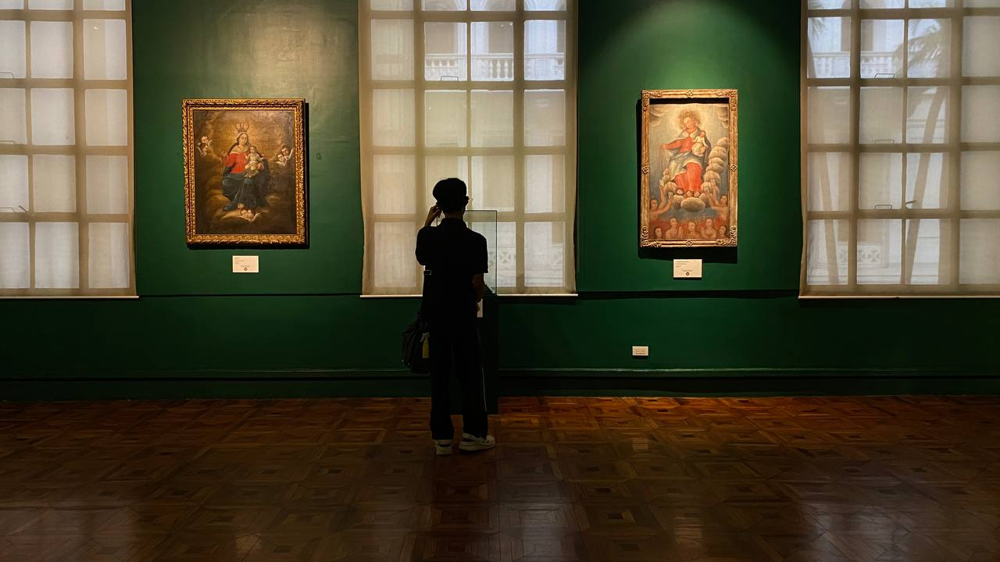
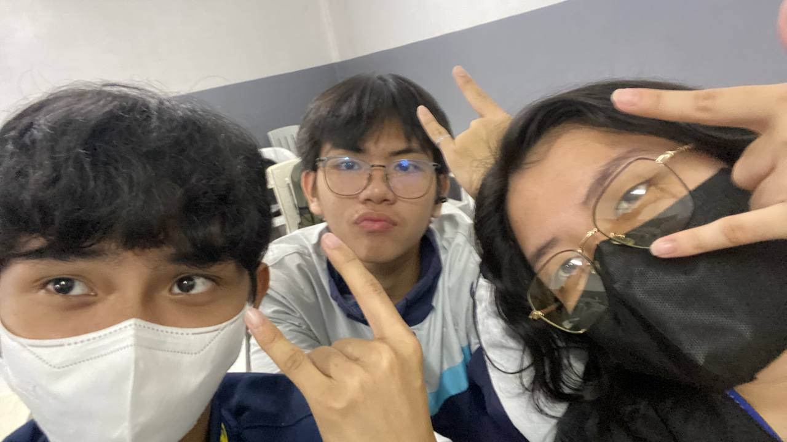
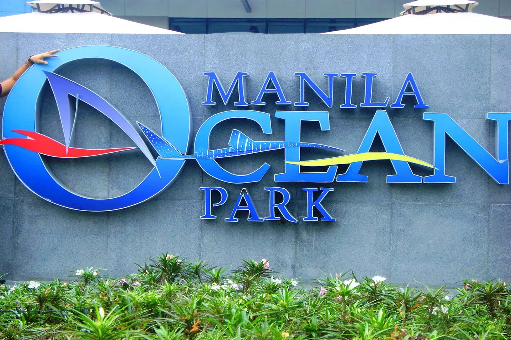
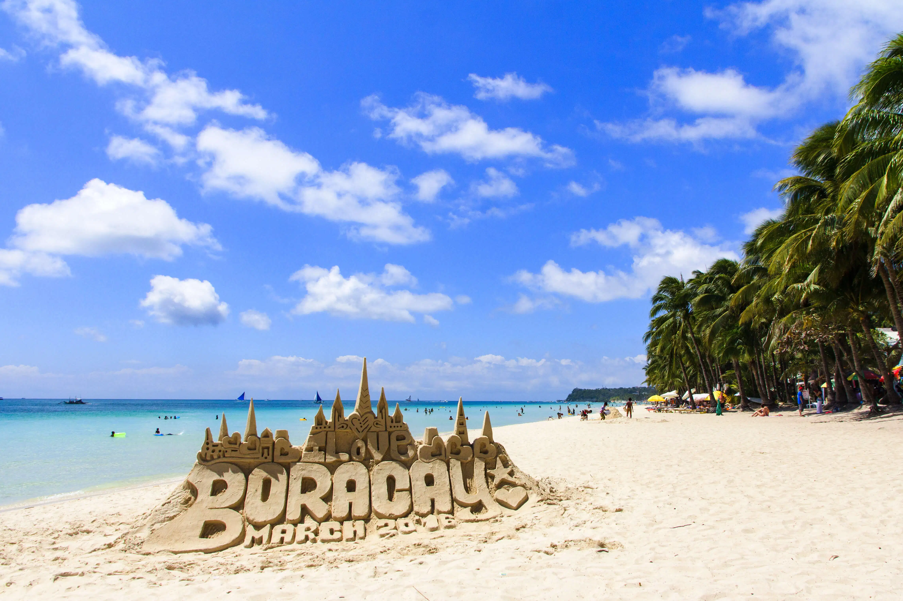
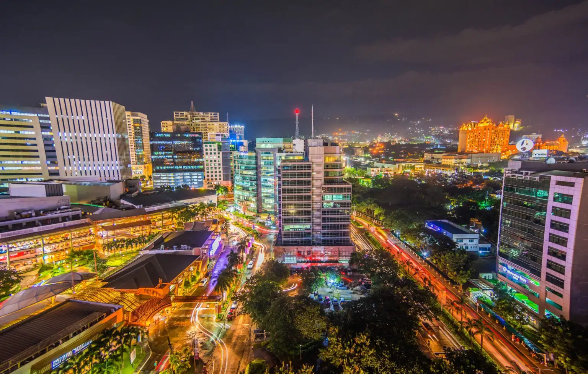
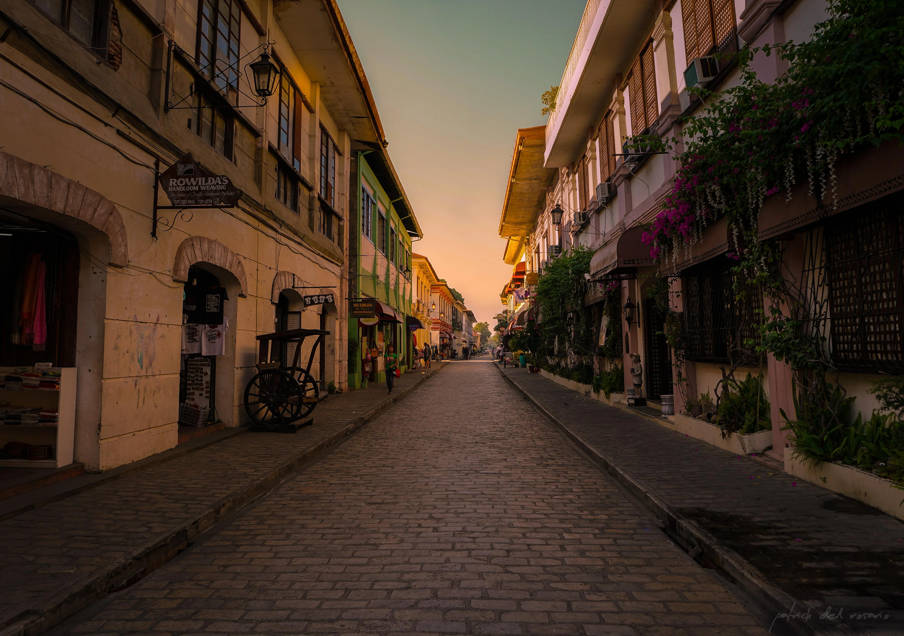

<html>
  <head>
    <title>TRAVELOGUE</title>
    <meta charset="UTF-8">
    <meta name="viewport" content="width=device-width, initial-scale=1">
    <link rel="stylesheet" href="https://www.w3schools.com/w3css/4/w3.css">
    <link rel="stylesheet" href="https://fonts.googleapis.com/css?family=Raleway">
    
    <link rel="stylesheet" href="final.css">
    
  </head>
<body class="w3-light-grey">

<!-- w3-content defines a container for fixed size centered content, 
and is wrapped around the whole page content, except for the footer in this example -->

<!-- Header -->
<header class="w3-container w3-center w3-padding-32"> 
  <h1><b>TRAVELOGUE</b></h1>
  
Project in FIL-121 Attractions

</header>

<!-- Grid -->

  

    <iframe width="1120" height="315" src="https://www.youtube.com/embed/DcMEIrcIxF8?si=WWcYqMI_92aeWkp2" title="YouTube video player" frameborder="0" allow="accelerometer; autoplay; clipboard-write; encrypted-media; gyroscope; picture-in-picture; web-share" referrerpolicy="strict-origin-when-cross-origin" allowfullscreen></iframe>
      >
      

        <h3><b>TRAVELOGUE</b></h3>
        <h5><b>Description</b> November 29, 2024</h5>
      

  
     

        
Samahan niyo kami sa pagbisita sa tatlong sikat na lugar sa Maynila! Una, sa National Museum, kung saan unang beses naming namangha sa mga exhibit na nagkukuwento ng yaman ng kasaysayan at talento ng mga Pilipino. Bagamat sa unang palapag lang kami nakapaglibot, bawat artifact at pintura ay tila nagsasalaysay ng ating pagkakakilanlan.
          Pangalawa, ang Intramuros, isang makasaysayang lungsod na tila nagbabalik sa lumang panahon. Mula sa makalumang estruktura hanggang sa pagrenta ng bike para libutin ang lugar, tunay na mararamdaman mo ang kasaysayan dito.
          Huling destinasyon namin ay ang Rizal Park, kung saan nagpapaalala ang tahimik na ambiance ng mga sakripisyo ni Dr. Jose Rizal. Paborito namin ang makulay na dancing fountain sa gabi at ang saya ng simpleng pagbili ng mga laruan.
          Sa kabuuan, ang Maynila ay puno ng kasaysayan, kagandahan, at lugar na maaaring balik-balikan!

        

          

          
          

          

            
          

        

      

    

 
  

  
  

    
    

      <h3><b>Intramuros</b></h3>
      <h5>Short description, June 24, 1571</h5>
    

    

      
Intramuros, the historic walled city of Manila, is a captivating journey back in time.
        Explore its cobblestone streets, admire the imposing Fort Santiago, and marvel at the stunning San Agustin Church, a UNESCO World Heritage Site. 2  Immerse yourself in the rich history and colonial architecture of this enchanting district, a true gem within the bustling metropolis.

      

        

          <a href="https://en.wikipedia.org/wiki/Intramuros" target="_blank"> 
<button class="w3-button w3-padding-large w3-white w3-border"><b>READ MORE »</b></button>
 </a>
        

        

        

      

    

  

  

  <!-- Blog entry -->
  

  
    

      <h3><b>National Museum Of The Philippines</b></h3>
      <h5>Short description, October 29, 1901</h5>
    

    

      
The National Museum of the Philippines is a treasure trove of Filipino history, art, and natural wonders.
        It houses a vast collection of artifacts, from ancient relics to contemporary masterpieces. Explore the stunning galleries showcasing the country's rich cultural heritage, including paintings, sculptures, and indigenous artifacts. Immerse yourself in the beauty of the natural world at the National Museum of Natural History, where you can discover the diverse flora and fauna of the Philippines.

      

        

        <a href="https://en.wikipedia.org/wiki/Intramuros" target="_blank">  
<button class="w3-button w3-padding-large w3-white w3-border"><b>READ MORE »</b></button>
</a>
        

        

          
        

      

    

  

<!-- END BLOG ENTRIES -->

<!-- Blog entries -->

    <!-- Blog entry -->
    

      
      

        <h3><b>Rizal Park</b></h3>
        <h5>Short description, December 19, 1995</h5>
      

  
      

        
Luneta Park, also known as Rizal Park, is a historic urban park in Manila. It's a popular destination for locals and tourists alike, offering a serene escape from the bustling city. The park is home to the Rizal Monument, a memorial dedicated to the national hero José Rizal. Visitors can enjoy leisurely strolls, picnics, and breathtaking views of Manila Bay. The park also features a colorful dancing fountain show that illuminates the night sky.

        

          

          <a href="https://en.wikipedia.org/wiki/Intramuros" target="_blank">  
<button class="w3-button w3-padding-large w3-white w3-border"><b>READ MORE »</b></button>
</a>
          

          

          

        

      

    

    

    

    

<!-- Introduction menu -->

  <!-- About Card -->
  

  
    

      <h4><b>US</b></h4>
      
Allysa manuel, Andrie Alzaga and Jhon subang, We created this webpage for our project in FILL-121

    

  

  
  <!-- Posts -->
   

  

    

      <h4>Other Popular Places in The Philippines</h4>
    

    <ul class="w3-ul w3-hoverable w3-white">
      <li class="w3-padding-16">
      
        Manila Ocean Park 
        Manila
      </li>
      <li class="w3-padding-16">
      
        Boracay 
        Western Visayas
      </li> 
      <li class="w3-padding-16">
      
        Cebu City 
        Cebu
      </li>   
      <li class="w3-padding-16 w3-hide-medium w3-hide-small">
      
        Vigan City 
        Ilocos Sur
      </li>  
    </ul>
  

  

 
  <!-- Labels / tags -->
 

    

      <h4>Contributes</h4>
    

    

    
Jhon Subang -Website Making  Allysa Manuel -Video Editing
      Jhon Subang -Video Editing Andrie Alzaga -Videographer Allysa Manuel -Videographer
      Andrie Alzaga -Voice Over Allysa Manuel -Voice Over 
    

    

  

  
<!-- END Introduction Menu -->
<!--
-->

<!-- END GRID -->
<!--
 -->

<!-- END w3-content -->
<!--
-->

<!-- Footer. This section contains an ad for W3Schools Spaces. You can leave it to support us. -->
<!--<footer class="w3-container w3-dark-grey w3-padding-32 w3-margin-top">
  <button class="w3-button w3-black w3-disabled w3-padding-large w3-margin-bottom">Previous</button>
  <button class="w3-button w3-black w3-padding-large w3-margin-bottom">Next »</button>
  
This website was made with W3schools Spaces. Make your own free website today!

  <a class="w3-button w3-round-xxlarge w3-small w3-light-grey w3-margin-bottom" href="https://www.w3schools.com/spaces" target="_blank">Start now</a>-->
  <!-- End footer. -->
 <!-- </footer>-->
 

  <h1> THANK YOU!!!! </h1>
 

git add .
git commit -m "remove username"
git push
